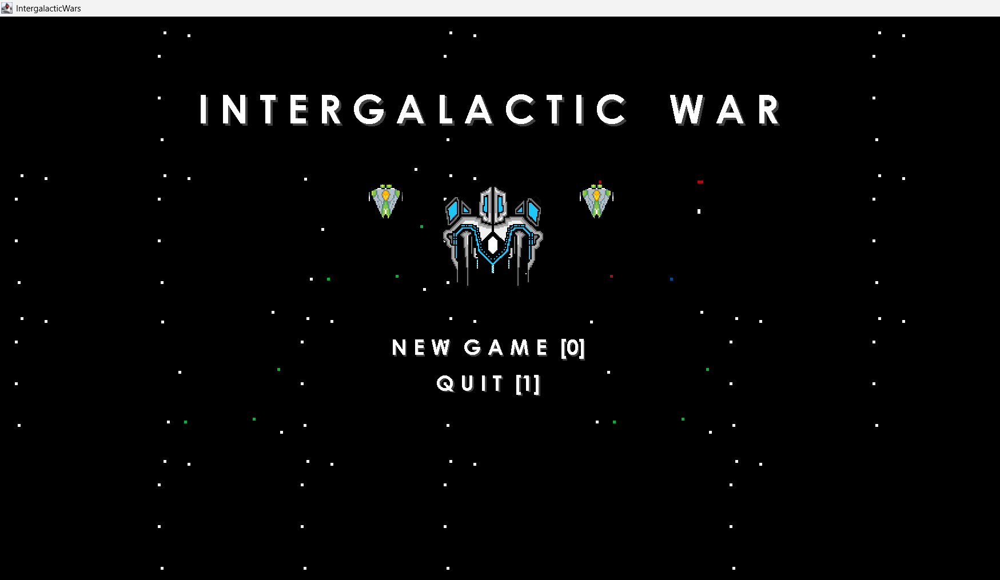
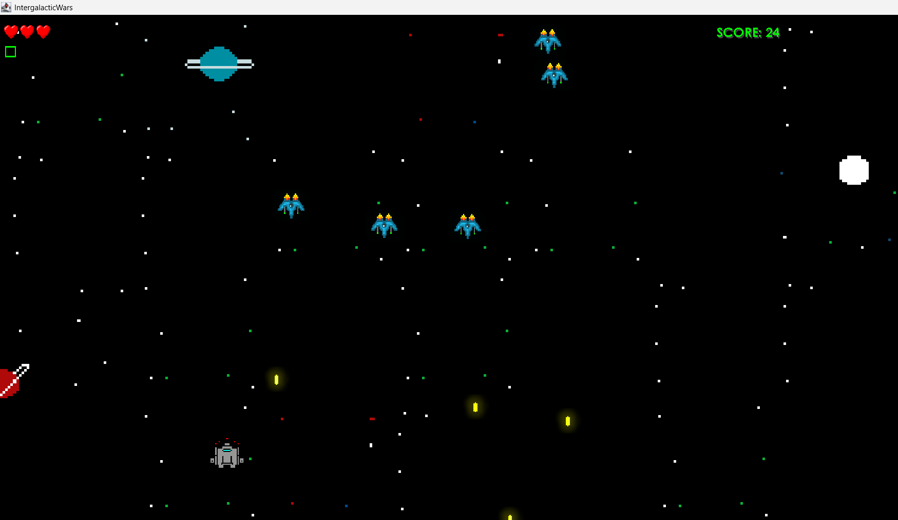
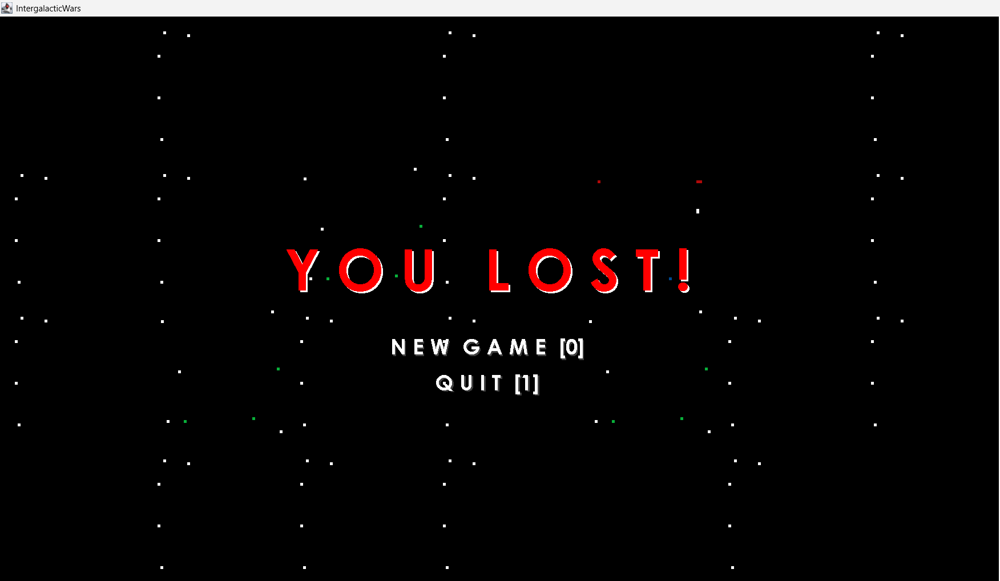

# Intergalactic War - 1st Year Student Project

  
  
  

## Project Information

**Group Name:** XP Merchants  
**Project Title:** Intergalactic War  
**Project Page:** [GitHub Repository](https://github.com/AngaIV/Intergalactic-War)

## Team

**Group Members:**
- Anga Peter
- Liteta Tosi
- Caiphus Mahlatji

**Group Mentor:** Alden Boby

## About the Game

Intergalactic War is a Java-based arcade-style shooting game where the player progresses through waves of enemies across multiple levels. The game becomes more challenging as the player advances, requiring careful movement, shooting, and power-up management.

## Controls
<table> <tr> <th>Action</th> <th>Key</th> </tr> <tr> <td>Start New Game</td> <td><code>0</code> key above the letters</td> </tr> <tr> <td>Quit Game</td> <td><code>1</code></td> </tr> <tr> <td>Move Player</td> <td>Arrow Keys</td> </tr> <tr> <td>Shoot</td> <td><code>S</code></td> </tr> <tr> <td>Pause Game</td> <td><code>P</code></td> </tr> </table> 
 <strong>Note:</strong> Use the <code>0</code> key above the letter keys, not the number pad. 

## Tools Used
<table> <tr> <th>Tool</th> <th>Purpose</th> </tr> <tr> <td><strong>Java</strong></td> <td>Used to build the game logic and functionality.</td> </tr> <tr> <td><strong>Adobe Photoshop</strong></td> <td>Used for editing and enhancing visual elements.</td> </tr> <tr> <td><strong>Piskel</strong></td> <td>Used for creating and editing pixel-art characters and game assets.</td> </tr> </table>

## How to Run the Game

### Option 1: Run the JAR File

1. Download and run the `IntergalacticWar.jar` executable file.
